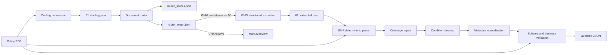

# Insurance Policy Extraction Pipeline

A hybrid extraction pipeline that converts Spanish-language GNP medical insurance policy PDFs into structured, provenance-aware, schema-validated JSON.

The pipeline combines:

- **Docling** for PDF layout and table extraction.
- **Ollama** for schema-constrained extraction from page-level evidence.
- **PyMuPDF** for deterministic GNP-specific parsing and repair.
- **JSON Schema** plus business rules for final validation and SQL-readiness checks.

The current implementation targets the layouts and terminology found in GNP policies. It dynamically discovers insured certificate blocks, so it is not limited to a fixed number of insured people.

## Pipeline overview



The GNP parser is deliberately deterministic where the PDF layout is reliable. It re-reads the source PDF to repair coverage rows, route and deduplicate conditions, reconstruct foreign-care rules, extract document sections, and normalize page-one metadata. The LLM is used for constrained extraction rather than as the final authority.

The document router runs immediately after Docling and before any LLM extraction. Its rules live in `config/router/ramo_signals.json`, runtime scores are saved to `router_scores.json`, and the routing/eval summary is saved to `router_result.json`. Current branch execution continues only when the router classifies the document as `GMM` with confidence at or above the configured threshold; lower-confidence documents route to manual review as `UNKNOWN`.

## Requirements

- Python 3.14 is used by the included local virtual environment.
- [Ollama](https://ollama.com/) must be installed and running.
- The default Ollama model is `qwen3:8b`.
- Runtime Python packages: `docling`, `ollama`, `pymupdf`, and `jsonschema`.

Dependencies are declared in `pyproject.toml`. To create an environment with `uv`:

```bash
uv sync
ollama pull qwen3:8b
```

Run commands through `uv`:

```bash
uv run python process_policy.py path/to/policy.pdf
```

`process_policy.py` also attempts to add packages from the repository's `.venv` to `sys.path`, but using `uv run` is recommended.

## Usage

Run the complete pipeline from the repository root:

```bash
uv run python process_policy.py path/to/policy.pdf
```

For example:

```bash
uv run python process_policy.py test_policies/gmm_linea_azul_746129345.pdf
```

Use a different Ollama model or schema:

```bash
uv run python process_policy.py path/to/policy.pdf \
  --model qwen3:8b \
  --schema schemas/gmm/policy/v3.json
```

Reuse an existing Docling conversion to skip the PDF-to-Docling stage:

```bash
uv run python process_policy.py path/to/policy.pdf \
  --docling-json audit_logs/reruns_with_docling/<previous-run>/01_docling.json
```

The original PDF is still required when `--docling-json` is supplied because the GNP parser and validator inspect it directly.

### Exit codes

| Code | Meaning |
| --- | --- |
| `0` | Validation passed and the result is marked SQL-ready. |
| `1` | Processing completed, but at least one high-severity warning remains or the result is not SQL-ready. |
| `2` | The PDF was not found or the pipeline raised an exception. |

## Outputs

Each invocation creates a timestamped diagnostic directory:

```text
audit_logs/runs/<pdf-name>_<YYYYMMDD_HHMMSS>/
├── 01_docling.json
├── router_scores.json
├── router_result.json
├── branch_dispatch.json
├── 02_extracted.json
├── 03_gnp_coverages.json
├── 04_gnp_cleaned.json
├── 05_gnp_normalized.json
└── debug_*.txt              # only when an Ollama call fails
```

The final result is written to:

```text
outputs/<pdf-name>_validated.json
```

Reprocessing the same PDF creates a new run directory but overwrites its final file in `outputs/`.

## Output model

`schemas/gmm/policy/v3.json` defines the current final contract for GMM policy output. Its top-level fields are:

| Field | Contents |
| --- | --- |
| `document` | Document type, language, and page count. |
| `policy` | Policy identifiers, plan, term, dates, currency, and movement data. |
| `policyholder` | Customer identity and contact information. |
| `premium_summary` | Policy-level premium, surcharge, fee, tax, total, and payment data. |
| `agent` | Agent name and code. |
| `insureds` | Dynamically discovered insured people, premiums, coverages, conditions, and source pages. |
| `policy_conditions` | Normalized policy- and insured-applicable conditions and rules. |
| `regulatory` | Registration number, date, and source page. |
| `document_sections` | Additional extracted policy sections. |
| `validation` | Warnings and the final severity/SQL-readiness summary. |

Monetary values retain both source text and normalized numeric/currency fields where the schema requires them. Extracted records carry `source_page` or related page lists so their provenance can be checked against the source PDF.

## Validation behavior

The final validator:

- removes known model control artifacts and normalizes empty contact labels;
- normalizes supported date formats to ISO `YYYY-MM-DD`;
- checks required policy and insured identifiers;
- verifies premium tax and total arithmetic;
- reconciles per-insured premiums with policy totals;
- verifies that source-page references exist in the PDF;
- detects duplicate coverages;
- reconciles condition and mixed-currency warnings;
- applies GNP Premier foreign-care corrections;
- validates the full result against `schemas/gmm/policy/v3.json` by default;
- sets `validation.summary.sql_ready` to `true` only when no high-severity warnings remain.

A schema-valid document can still be non-SQL-ready when a business or provenance check emits a high-severity warning.

## Configuration

Defaults live in `pipeline/config.py`:

| Setting | Default |
| --- | --- |
| Ollama model | `qwen3:8b` |
| Default GMM schema | `schemas/gmm/policy/v3.json` |
| Branch schemas | `schemas/{gmm,vida,autos,daños}/policy/*.json` via `PipelineConfig.schema_path_for(ramo)` |
| Final output directory | `outputs/` |
| Run artifact directory | `audit_logs/runs/` |
| RAMO router signals | `config/router/ramo_signals.json` |
| Temperature | `0` |
| Maximum predicted tokens | `4096` |
| Context window | `32768` |
| Ollama retries | `2` |

Only the model and explicit schema override are exposed as command-line options. By default, validation uses the schema for the routed RAMO branch. Change other defaults by constructing a `PipelineConfig` in Python or editing the configuration module.

The pipeline can also be called programmatically:

```python
from pathlib import Path

from pipeline.config import PipelineConfig
from process_policy import run_pipeline

config = PipelineConfig(model_name="qwen3:8b")
data, output_path, report = run_pipeline(Path("path/to/policy.pdf"), config)
```

## Repository layout

```text
.
├── process_policy.py                 # Supported end-to-end CLI and orchestrator
├── schemas/
│   ├── gmm/policy/v3.json            # Current GMM policy JSON Schema contract
│   ├── autos/policy/v1.json          # Placeholder schema; autos extraction not implemented
│   ├── daños/policy/v1.json          # Placeholder schema; daños extraction not implemented
│   └── vida/policy/v1.json           # Placeholder schema; vida extraction not implemented
├── pipeline/
│   ├── config.py                     # Runtime defaults and output paths
│   ├── bootstrap.py                  # Local .venv discovery
│   ├── common/                       # Shared text, table, money, date, LLM, JSON, and validation helpers
│   ├── branches/gmm/extract.py       # GMM extraction flow
│   ├── branches/gmm/parser.py        # Consolidated deterministic GNP/GMM parser
│   ├── branches/gmm/validate.py      # GMM final validator
│   └── router.py                     # RAMO router
├── tests/                            # Unit and fixture regression tests
├── test_policies/                    # Sample policy PDFs
├── outputs/                          # Example/final validated JSON files
├── audit_logs/                       # Intermediate and rerun artifacts
├── Archive/                          # Superseded scripts and historical outputs
└── graphify-out/                     # Generated code-graph analysis artifacts
```

For new integrations, use `process_policy.py` and the modules it imports. The versioned standalone scripts and `final_validate.py` remain useful as implementation history, but they are not invoked by the current end-to-end entry point.

## Tests

The suite can be run with `pytest`:

```bash
uv run pytest
```

Tests cover dynamic insured discovery, condition extraction and routing, coverage isolation, premium reconciliation, foreign-care matrices, string sanitization, schema validity, and SQL readiness.

### Current fixture caveat

`tests/test_gnp_dynamic_pipeline.py` hard-codes timestamped Docling and extraction artifacts under `audit_logs/runs/` and expects matching legacy `poliza_*` PDFs under `test_policies/`. In the current checkout, those PDF files are absent. Restore the PDFs or update `FIXTURE_RUNS` to available matching policies before treating those fixture regressions as runnable.

The unit tests mock Ollama calls where appropriate; running the full CLI requires a live Ollama service and the selected model.

## Troubleshooting

- **Ollama connection or model errors:** start Ollama and confirm the selected model is available with `ollama list`.
- **Structured extraction failure:** inspect any `debug_<tag>_attempt_<n>.txt` files in the run directory. Calls are retried according to `PipelineConfig.ollama_retries`.
- **No page-aware evidence:** regenerate `01_docling.json`; the extractor requires Docling text or table elements with page provenance.
- **Validation exit code 1:** inspect `validation.warnings` in the output, especially entries whose `severity` is `high`.
- **Unexpected overwrite:** copy or rename an existing file in `outputs/` before rerunning the same PDF name.

## Scope and data handling

The GMM parser contains GNP-specific Spanish headings, plan rules, and PDF layout heuristics. Supporting another insurer or materially different policy layout will require a separate branch parser such as `pipeline/branches/vida/parser.py`, `pipeline/branches/autos/parser.py`, or `pipeline/branches/daños/parser.py`.

Policy PDFs and generated JSON can contain sensitive personal and financial information. Keep fixtures, run artifacts, debug output, and validated results out of public version control and handle them according to your organization's data-retention rules. The current `.gitignore` excludes these artifact directories.
